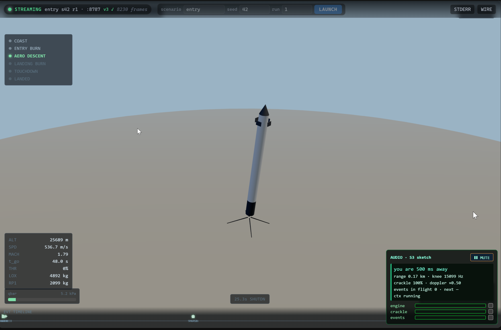

# Booster Lander Simulator

A 6-DOF, Falcon-9-class propulsive-landing simulator in which the guidance **actually solves
the landing in real time** — no scripted trajectory, no assist term, no nudge toward the pad.
A native C11 physics-and-guidance core flies the vehicle, proves itself headless with
Monte-Carlo success rates, and streams one-way binary telemetry to a Tauri v2 + three.js
(WebGPU) renderer that is a **pure observer**. The architecture is deliberately built so that
faking either half — the physics or the flight — is structurally impossible: state changes
only ever pass through the integrator, and if the guidance cannot solve a descent, the booster
crashes.

> This is an engineering simulator first and a visualization second. The renderer draws only
> what the telemetry tells it. Delete `ui/` and `shell/` and the core still runs, still lands,
> and still prints its success rate.



> *LZ-COCKPIT: the booster on a live, unscripted aero-descent — external tracking camera,
> guidance HUD, and propagation-delayed audio, all driven by the one-way telemetry stream.*

---

## Run it (Windows)

A one-click desktop app — its own window, no terminal, no browser. It spawns and supervises the
simulation core itself; just launch and press **LAUNCH**.

- **[Download the latest Windows release »](https://github.com/bochen2029-pixel/booster-lander-simulator/releases/latest)** — grab the **portable `.zip`** (unzip, double-click `Booster Lander.exe`) or the **`-setup.exe`** installer.
- Controls: **drag** to orbit the external camera, **wheel** to zoom, **LAUNCH** to fly another
  seed/scenario/run. The view stays third-person external so you always watch the booster land.
- Unsigned build — SmartScreen may warn on first launch (*More info → Run anyway*).

> **Coming soon: an Unreal Engine 5 client.** The telemetry protocol is renderer-agnostic by
> design, so a UE 5 observer — Nanite hull, Lumen/MegaLights plume-as-light, Niagara pyro,
> MetaSounds — is being built as *another* pure client on the exact same stream. The core never
> changes; the WebGPU cockpit stays the fast, always-works view, and UE becomes the IMAX theater.

---

## Why it is hard to fake

Most "rocket landing" demos animate a known-good path. This one cannot, by construction. Six
prime directives (below) are enforced throughout the codebase:

- **State changes only through the integrator.** The entire output of the guidance layer is an
  actuator command vector — throttle, two gimbal angles, four grid-fin deflections, an RCS mask.
  No code path anywhere writes position, velocity, attitude, angular velocity, or mass except
  `integrate_step()`.
- **If guidance can't solve it, the vehicle crashes.** No soft clamp toward the pad, no recovery
  mode that bypasses the controller. A crash, a tip-over, and a fuel-depletion ballistic arc are
  all valid, fully-simulated outcomes.
- **One dynamics source.** The plant, the hoverslam predictor, and (later) the MPPI rollouts all
  call the *same* `__host__ __device__`-ready equations of motion in `core/dynamics.c`, including
  actuator lag. Rollout-model drift from the plant would be a cheat with extra steps, so it is
  designed out.
- **Deterministic, and provably so.** Seeded counter-based RNG (Philox4x32-10), a compile-time
  fixed `dt = 2 ms`, no wall-clock reads in the sim path, no unordered floating-point reductions.
  Same seed + same scenario ⇒ bit-identical trajectory, checked by a `memcmp` oracle in the self-test.
- **Headless must work.** The same core binary, with no socket and no renderer, runs N randomized
  descents and prints a Monte-Carlo landing rate with a Wilson 95% confidence interval. **That
  artifact is the proof the simulation is real.**
- **The renderer is a pure observer.** The upstream command channel is a closed enumeration;
  nothing in it can write vehicle state. If the renderer crashes, the simulation is unaffected.

---

## Architecture

```
┌──────────────────────────────┐        one-way binary          ┌─────────────────────────────┐
│  core/  — native C11          │   telemetry stream (TLM/EVT     │  ui/  — three.js r185        │
│  (CUDA-ready, zero deps)      │   /HELLO/STATS, LE, packed)     │  WebGPU / TSL renderer       │
│                               │  ──────────────────────────▶    │  (pure observer)             │
│  physics plant + guidance     │        ws:// (RFC6455)          │  in a Tauri v2 shell/        │
│  + Monte-Carlo harness        │                                 │  (Rust sidecar supervisor)   │
└──────────────────────────────┘                                 └─────────────────────────────┘
        proves itself headless                                       proves itself by reproducing,
        (success rate + CI)                                          from telemetry alone, what a
                                                                     real landing looks like
```

- **`core/` — C11 physics + guidance (zero external dependencies).** US Standard 1976 atmosphere
  (0–86 km), gravity that varies with altitude, quaternion 6-DOF rigid-body dynamics, grid-fin and
  body aerodynamics, leg spring-damper-crush contact with friction and tip-over, RK4 integration
  with contact substepping. `dynamics.c` is the single shared EOM, written to compile for both host
  and CUDA device. No graphics, no sockets in the default build.
- **Telemetry protocol (`core/protocol.h`).** A `#pragma pack(1)`, little-endian, explicitly-padded
  packet layout with `_Static_assert`s on struct sizes and field offsets (verified with MSVC
  `cl /std:c11`: `sizeof(BlTlmFixed) == 276`, all offset asserts hold). The TypeScript decoder in
  `ui/src/net/decode.ts` mirrors it byte-for-byte.
- **`ui/` — three.js r185 WebGPU renderer (read-only).** A WebGPU bootstrap with reversed-depth
  buffer and AgX tonemapping (WebGL2 auto-fallback), a floating-origin camera rebase for a
  continuous 70 km → 1 m shot, a binary TLM decoder, an interpolation/replay ring buffer, and the
  single canonical sim→three coordinate conversion — all covered by a green vitest suite.
- **`shell/` — Tauri v2 (Rust).** Spawns the core as a sidecar, supervises and restarts it, kills it
  on close. It never touches simulation state.

---

## Key ideas

- **Determinism as a contract — with an explicit scope.** Fixed 2 ms step, seeded Philox RNG, no
  wall-clock in the sim path, no fast-math. Bit-identical replay is asserted, not hoped for. Scope:
  the **fp64 CPU plant is bit-identical everywhere the same binary runs** (the `memcmp` oracle), and
  the CPU MPPI is bit-identical under OpenMP (Philox lane-per-rollout + fixed pairwise-tree
  reductions). GPU rollouts, when they land (M5), are **structurally shared** (`__host__ __device__`
  same source, `-fmad=false`, no atomics) but promise bit-identity only per GPU architecture
  (goldens pinned `sm_89`); CPU↔GPU parity is a *toleranced* gate (per-step |Δr| < 1e-3 over 200
  steps), not a bit claim — FMA contraction and device libm make cross-device bit parity a mirage,
  so the contract never claims it.
- **Headless Monte-Carlo as the proof-of-realness.** The core runs thousands of randomized descents
  and reports the landing rate with a Wilson-95 interval and a crash-cause breakdown
  (off-pad / too-hard / fuel-out / other). Numbers, not vibes.
- **Anti-cheat prime directives.** State only through the integrator; guidance that can't solve it
  crashes; the renderer draws only what it is told.
- **One shared dynamics source** for the plant, the guidance predictor, and future rollouts —
  parity by construction.
- **Physically-grounded plant.** US76 atmosphere, altitude-varying gravity, grid-fin aerodynamics,
  a marginally-unstable bare airframe (center of pressure ahead of center of mass, as a real
  finned body descending engine-first), body pitch damping, and contact/tip-over dynamics.
- **Plant-first discipline.** Every time the project stalled, the block turned out to be missing or
  wrong *plant* physics upstream of the controller — so the plant was independently audited by a
  fleet of five compiled-C agents across three code paths before trusting the control loop.

---

## Status (honest)

This is an in-progress build. What is claimed below is verified at the current checkpoint; what is
not done is called out explicitly. Two provenance notes: this repository is a **public mirror** of a
local working tree — development happens against local ledgers (`RUN_STATE.md`, the append-only
`DECISIONS.md` ADR log, frozen `goldens/`), and pushes are periodic consolidated snapshots, so the
public commit history is intentionally coarse while the decision history lives in `DECISIONS.md`.
And the claims below no longer require trusting the author's machine: **CI re-runs the 10-oracle
selftest (including the bit-identical determinism `memcmp`) and a 200-run Monte-Carlo gate on a
clean `windows-latest` runner on every push** (`.github/workflows/ci.yml`).

**Done and verified (milestones M0–M2 + an independent physics audit):**

- **Full C11 headless core** — builds clean under MSVC 2022 with zero external dependencies.
- **Ten physics oracles pass** (`--selftest`): US76 atmosphere, Philox RNG determinism + normal
  statistics, quaternion/frame vectors, vacuum ballistic vs. closed-form, coast `|q| = 1`, analytic
  inertia-rate vs. finite difference, hover-impossibility (minimum TWR ≈ 1.32), grid-fin passive
  stability, aero-descent closed-loop stability, and a **bit-identical determinism `memcmp`**.
- **TERMINAL hoverslam lands ~97–98%** of randomized descents (Wilson-95 CI), across multiple seeds,
  on the honest, audited plant — with 0 off-pad and 0 fuel-out failures. The residual hard-touchdown
  tail is **lateral-coupled, not solver-quantization-limited** (measured: corr(td_lat, td_v) ≈ +0.64
  across the tail, while the ignition-timing quantization bound at the 50 Hz guidance tick is only
  ~0.2 m/s — the tail is a dispersion/steering problem, not a discretization floor).
- **ENTRY (62 km, Mach ~5, 3 km cross-range) lands 41–50%** across seeds 42/7/99 (median miss
  ~23 m, 99/100 within 50 m, zero structural failures) — via the predictive entry-burn supervisor,
  a ZEM/ZEV collision-course bank during the three-engine burn, and an SRP-shielded landing burn.
- **AERO_OFFSET (12 km, mean 500 m offset) lands 55–60%** under the reactive tier-0 law and
  **63.3%** under the integrated lateral-only MPPI (CPU, K=256, bit-deterministic under OpenMP).

### What the Monte-Carlo numbers mean (the dispersion envelope)

A landing rate is meaningless without the randomization it survives. Per run (all 1σ, seeded,
bit-replayable): initial altitude ±6%, vertical speed ±12 m/s (TERMINAL) / ±20 m/s (others),
lateral offset σ 30 m (TERMINAL) / **mean 500, σ 150 m** (AERO_OFFSET) / **mean 3000, σ 250 m**
(ENTRY), horizontal velocity ±5 m/s per axis, initial tilt (scenario base 3–6°) ±2° at random
azimuth, body rates ±0.02 rad/s, propellant load ±2%. Environment: an altitude power-law mean-wind
profile (u_ref 3 / 6 / 8 m/s for TERMINAL / AERO / ENTRY, seeded azimuth) plus seeded Dryden
turbulence (15 / 30 / 30 kt severity) — **guidance never reads the wind; it flies through it on
state feedback alone**. With `--inject`, additional parameter dispersions the guidance cannot see:
thrust up to −8%, Isp up to −1%, CoM offset up to 2 cm at random azimuth (TERMINAL passes this
Tier-B at 97.3–98.1%).

**Honest scoping of what is still idealized:** guidance currently reads true state (the canon's
`NAV_NOISY` measurement layer — position/velocity/attitude noise and gyro bias — is specified but
not yet implemented), and the guidance's internal predictors share the plant's aero tables (thrust
/Isp/CoM/wind mismatch is exercised via `--inject` and the blind winds; aero-coefficient scatter is
not yet dispersed). The physics is honest; the estimation problem is the next honesty upgrade.
- **Plant physics independently audited** — a 5-agent, C-only audit confirmed the dynamics on three
  separate code paths and found and fixed real bugs (grid-fin allocation signs, gimbal rate-state
  windup, missing roll damping, a transonic CoP artifact).
- **Renderer + protocol groundwork built and green** — `core/protocol.h` compiled and
  static-asserted; the full `ui/` scaffold on `three@0.185.1` (WebGPU) with a passing vitest suite,
  including the binary telemetry decoder and the canonical sim→three frame conversion; and the
  Tauri v2 shell config. A minimal RFC6455 WebSocket path (`--serve`) that lets the renderer track a
  descent from live telemetry is being wired next.

**In progress / not yet done:**

- **Closing ENTRY/AERO to their ≥90% gates** — the remaining tails are a 26–33 m pad-grazing band
  and a hard-touchdown tail on uncentered arrivals (tuning, not architecture; the measured optimal-
  divert ceiling from 12 km is ~1.1 km, so the dispersions are physically well-posed).
- The **NAV_NOISY measurement layer** (estimation honesty) and aero-coefficient scatter.
- **MPPI on CUDA** (`sm_89`, K=16384, p99 ≤ 6 ms gate) — the CPU MPPI is the frozen parity reference.
- The **full cinematic renderer** — the binary-telemetry `--serve` path is live and validated
  end-to-end; plume, dust, sky, audio propagation, HUD, and director camera are designed and
  partially scaffolded but not yet wired live (needs a real WebGPU browser, not headless).

See `RUN_STATE.md` for the current ledger and `DECISIONS.md` for the architecture-decision log
(D-001 …). The canon is `CLAUDE_v2.md` (adopted D-019): it adds the perception-to-policy
track — a learned `GM_NEURAL` guidance tier trained toward the reachability frontier, plant
modules for engine-out and a movable target, and a VLM-ready target-estimate socket — all
behind default-off flags with byte-identity gates.

---

## Build & run

> **Toolchain (pinned):** MSVC 2022 (Visual Studio 17), CMake, C11. CUDA 13.1 targeting `sm_89` is
> wired for later GPU work but not required for the headless core. The renderer uses Node 24 + pnpm
> with `three@0.185.1` exact.

Configure and build the core (Windows / Visual Studio generator):

```powershell
cmake -S . -B build -G "Visual Studio 17 2022" -A x64
cmake --build build --config Release
```

Run the self-test (the ten oracles) and a Monte-Carlo campaign:

```powershell
# 10-oracle self-test, including the bit-identical determinism memcmp
.\build\bin\Release\booster-core.exe --selftest

# 1000 randomized TERMINAL descents → landing rate + Wilson-95 CI + crash-cause histogram
.\build\bin\Release\booster-core.exe --headless --scenario terminal --seed 42 --runs 1000

# a single verbose trajectory trace (tilt / lateral / rates per line)
.\build\bin\Release\booster-core.exe --run --scenario terminal --seed 42 --run 0 --verbose
```

Run the renderer against a live telemetry stream (once built):

```powershell
# terminal 1: the core, serving binary telemetry over a WebSocket
.\build\bin\Release\booster-core.exe --serve

# terminal 2: the three.js / WebGPU renderer as an observer
pnpm -C ui install
pnpm -C ui dev        # pnpm -C ui test | pnpm -C ui typecheck
```

---

## Repository layout

```
CLAUDE_v2.md          canon specification (read §0–§2 first; v1/v0 kept as history)
RUN_STATE.md          session ledger — current milestone and next action
DECISIONS.md          append-only architecture-decision log (D-001 … )
NEXT_SESSION.md       cold-start / continuation plan
core/                 C11 plant + guidance + sim + Monte-Carlo (zero deps, CUDA-ready)
  dynamics.{h,c}      the single shared EOM (body + grid-fin aero, damping, mass props)
  integrator.{h,c}    RK4 + quaternion handling + contact substepping
  contact.{h,c}       leg spring-damper-crush, friction, tip-over, verdict
  control.{h,c}       attitude PD + gimbal / RCS / fin allocation + angle-of-attack hold
  guidance_hoverslam.{h,c}   tier-0 suicide-burn guidance
  atmosphere.{h,c}    US Standard 1976
  rng.h  vmath.h  constants.h  state.h  scenario.{h,c}  sim.{h,c}
  protocol.h          telemetry packet layout (compiled + static-asserted)
  main.c              CLI: --selftest | --headless | --run   (--serve is being wired next)
ui/                   three.js r185 WebGPU renderer (read-only observer; vitest green)
shell/                Tauri v2 sidecar shell (Rust supervisor)
runs/                 design notes and audit artifacts (C harnesses, MC CSVs, taxonomies)
goldens/              frozen MC baselines + protocol byte goldens (re-baselining is an ADR event)
data/reference/       public telemetry reconstructions (events.xlsx — webcast-derived, reference only)
.github/workflows/    CI attestation: selftest + MC gate on a clean runner per push
```

`core/` must build and run with `ui/` and `shell/` deleted.

---

## Design tenets

1. **State changes only through the integrator** — guidance emits actuator commands, nothing else.
2. **Fixed 2 ms timestep, always** — never a frame delta, never a wall-clock delta.
3. **Deterministic and provably so** — seeded Philox, no wall-clock in the sim path, bit-identical replay.
4. **If guidance can't solve it, the vehicle crashes** — no assist terms, no clamps toward the pad.
5. **One dynamics source** — plant, predictor, and rollouts share the same `__host__ __device__` EOM.
6. **Headless must work** — the Monte-Carlo success rate is the proof the simulation is real.
7. **The renderer is a pure observer** — it draws only what the telemetry tells it; delete it and the core is unaffected.
8. **Physics first, aesthetics second — but aesthetics are not optional** — both maxima are the project.

---

## License

[MIT](LICENSE) © 2026 Bo Chen
